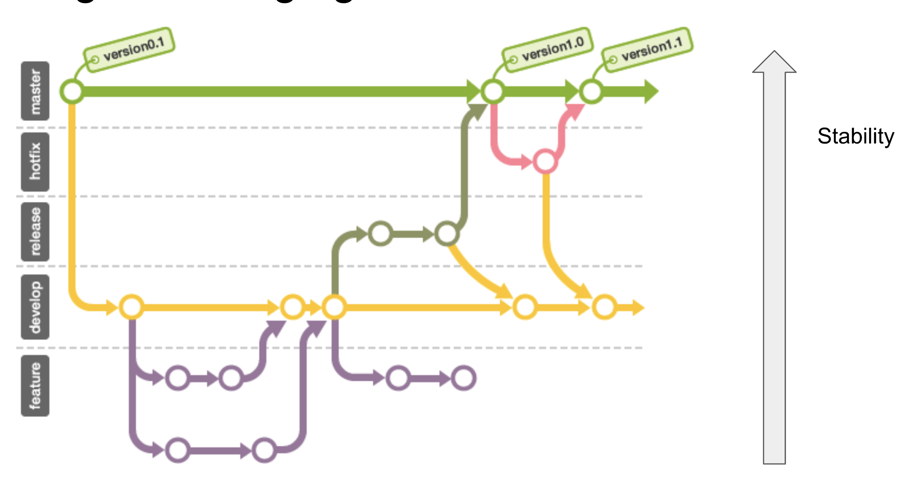

### Today's Key 🔑

**CLI에서 sudo 커맨드와 사용자 권한에 대해서 공부하였다.**
 

- `sudo` : 관리자 권한으로 특정 행위를 실행하는 커맨드
- sudo 커맨드가 모든 것의 권한 문제를 해결하는 솔루션이 아니다.
- 한 번 인증하면 그 이후에는 인증 과정을 생략한다. -> 최대한 user 권한으로 해결
- `sudo touch 파일명` → 관리자 권한으로 파일 생성 → staff 권한은 변경이 힘들다.
- `sudo chown 유저이름:staff 파일명` → 관리자 권한 생성 파일의 소유자 변경 → 권한 변경

 

**분산 시스템과 버전 관리에 특화된, 그것은 GIT**
 

- `fork` → repo 자체를 통으로 내 계정에 가지고 오는것 → fork 한 레포를 'origin' 이라고 한다.
- `clone` → 내 컴퓨터에서 fork한 소스를 수정할 수 있게 복제하는 것 → 말 그대로 수정할 수 있는 권한을 내가 임의로 가져오는 것이라고 볼 수 있다.
- 클론된 로컬 레포에서 수정한 사항을 orgin에 반영하는 방법 : `git push origin branchName(master)`
- origin 레포에 누군가가 수정한 사항을 로컬에 당기는 방법 : `git pull orgin branchName (master)`
- 원본 레포에서 내 로컬로 땡기는 것 : `git pull upstream branchName`
- `git status` → 버전 관리를 위해 변경된 파일이 있는지 확인
- `git add` → 수정한 파일을 깃에 추가해준다.
- `git commit am 'message'` → 한 번 이상 add 처리가 된 파일은 이렇게 바로 커밋할 수 있다.
- `git commit -m 'message'` → commit과 커밋 메시지를 작성한다.
- `git push origin master` → 커밋한 것을 마스터 브랜치로 풀한다.

 

### 추가로 공부하자 💪🏼
