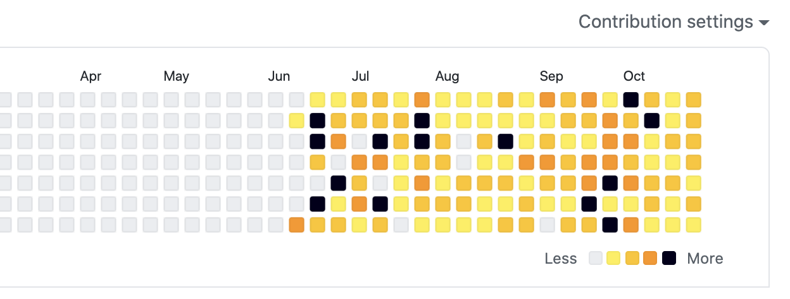
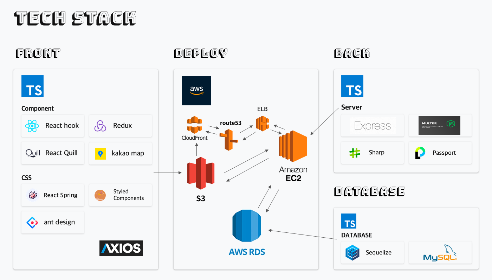

## 🎃 해피 할로윈?

깃헙의 잔디보드가 할로윈을 맞아서 잭 오 랜턴의 색으로 변경된 것이 너무 귀여워서 스샷을 남겼다. 🎃

 

## 4주 프로젝트 25일차 (마무리를 할 수 있을까?)

- [x] 조급하거나 답답한 감정이 느껴지면 크게 한 숨을 쉬고 다시 시작해보기  
- [x] api 연동, 빠르게 할 수 있도록 하자  
- [x] 개인 발표 준비 마무리 + 콘티짜서 멘트도 준비하기  
- [x] 팀 위키 및 발표 준비 마무리 + 콘티짜서 멘트도 준비하기  

내가 초록색을 좋아한다는 것을 이번에 다시 알게되었다. 옛날에 눈이 안 좋은 나를 위해서 엄마가 계속 멀리보고, 푸른 걸 많이 보라고 했던 기억이 있다. 갑자기 이 이야기를 하는 이유는 최근에 코드를 작성하면서 우선적으로 선택하는 색이 초록색이라는 것과 수 많은 초록색 요소를 봐도 질리지가 않는 점이다. 뭔가 내 삶 속에서 리프레시가 필요하다는 신호가 아닌가 한다. 프로젝트가 끝나면 산에 한 번 가고싶다.  

## 🦄 Today's Key

- 내일이면 프로젝트가 확실하게 마무리되어야 한다. 그래서 오늘 내가 작업한 클라이언트 코드에 아직 덜 만들어진 서버 api를 받는 코드를 조금 더 다듬었다. 이미 만들어진 서버와 통신하는 코드가 잘 동작하는지 다시 확인했다.
- 팀 프로젝트의 얼굴인 wiki, ReadMe를 작성하고 있다.
- 개별 발표에서 진행할 주제를 정리하고 키노트로 조금씩 슬라이드를 만들고 있다. 빨리 월요일이 오면 좋겠다.

 

