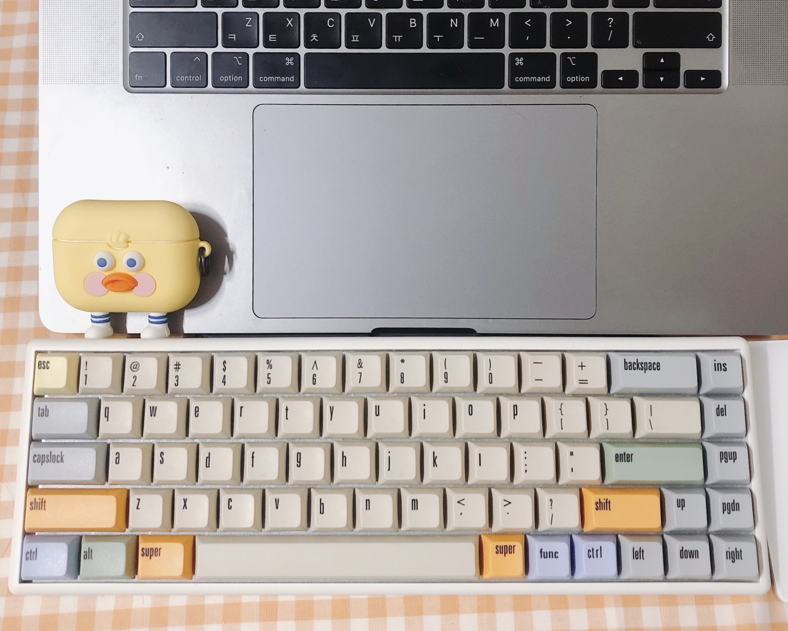

본격적인 리액트 스프린트 주간이 시작되었다. 큰맘 먹고 지른 키캡도 도착해서 도각 거리는 내 키보드에 예쁜 옷을 입혀주었다. 코로나가 다시 퍼져가는 것이 심상치 않다. 예비군도 결국 취소되었다. 개꿀.  

오늘 페어프로그래밍을 해보면서 스스로 막연하게 어색하다고 생각했던 리액트가 어느정도 몸에 베여있다는 사실을 알앗다. 계속 반복해서 공부하고 자연스럽게 사용해보면서 더 익숙하게 만들어야겠다.  

다음주에 있을 2차 HA를 위해서 이번 주말을 통해서 복습하는 시간을 가져야 할 것 같다.
 

### Today's Key 🔑

- (오전 시간) useReducer로 기본 코드를 리팩토링 하고, 이것의 사용성에 대해서 switch 구문 블로깅과 함께 정리했다. 
  [Javascript Switch 조건 구문 블로깅](https://www.notion.so/ddovblek/Switch-2580c47bed764c3db8f9b07905f09241)  
  [React Hook - useReducer 블로깅](https://www.notion.so/ddovblek/useReducer-6133693aa79a4901b5321f923d16dc05)
- (점심 이후) 페어님과 함께 recastly 스프린트를 본격적으로 시작했다.
- (페어프로그래밍 시간) 컴포넌트 간에 props로 데이터와 함수를 전달 받는 부분을 페어님께 조금 어렵게 설명한 것 같다. 그 과정에서 구조분해할당(destructuring)에 대한 문법 공부를 다시 할 수 있어서 좋았다. 페어님과 열심히 해당 부분에 대해서 의견을 나눴다.
- (페어프로그래밍) Youtube API를 이용하기 위한 키를 발급 받는 것까지 해결했다. 뒤에 남은 검색 기능과 데이터 불러오기는 차차 진행해보고자 한다.
- (저녁 이후) 커스텀 hooks를 제작하여 컴포넌트에 반영하는 방법에 대해서 공부했다. 어렵다. 계속 반복해서 사용해봐야 할 것 같다.
- (미니 프로젝트 정리) 오후 10시부터는 배웠던 리액트 기술을 사용하기 위해서 'my_real_animal' 이라는 미니 프로젝트를 기획하고 create-react-app 까지 진행했다. 진행 과정은 계속적으로 노션으로 관리할 예정이다.
