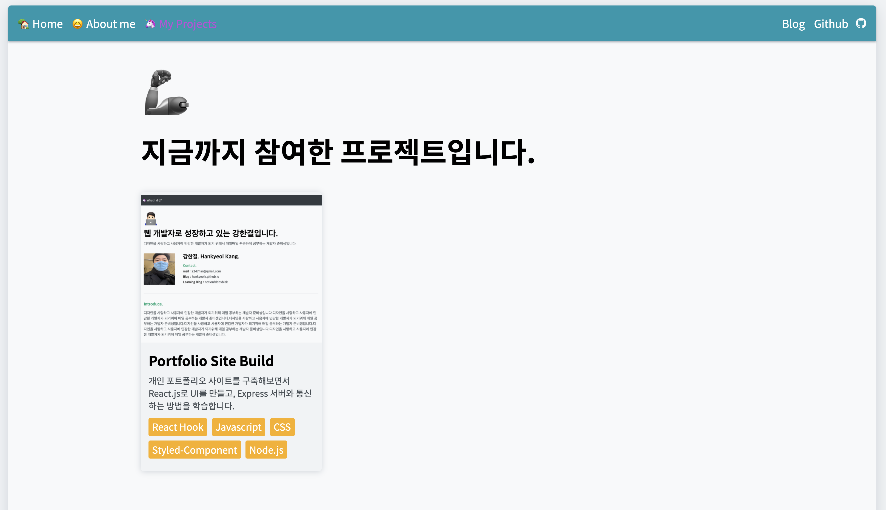

이머시브 코스 4주차를 회고한 날이 엊그제 같은데. 벌써 코드스테이츠 과정을 밟으며 써가는 TIL이 11주차를 종료하라고 알려준다. 시간이 정말 빠르다. 무더운 날들이 계속 흘러가고, 시간도 계속 지나간다. 성장하고 있는지에 대한 물음들이 머릿속에 계속적으로 남아있지만, 묵묵히 걸어갈 뿐이다. 왜냐하면 꾸준하게 개발 공부를 하고 나만의 것을 쌓아가는 것이 즐겁기 때문이다. 앞으로 남은 9주의 기간동안 정말 더 열심히 해야겠다. TIL을 멈추지 않겠다.! 🔥
 

### Today's Key 🦄

- 같은 디자인이 반복되는 컴포넌트를 하나로 합쳤다. 그 작업을 위해서 데이터 파일을 따로 빼내는 것이 편하다는 것을 알았다.
- CSS에서 display 요소에 inline-block을 주고 내부 개별 요소들을 flex로 정렬하는 것의 편리함을 알았다. (여전히 나날이 배우고 있다.)
- stateful한 요소들을 정립하고 Redux로 관리할 준비를 마쳤다.
