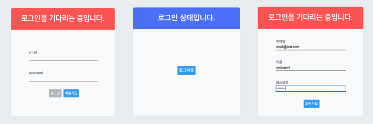

## 이머시브 8주차 회고

특히 힘들었던 한 주였다. 뭔가 개념적으로 잘 들어오지도 않았고, 이전에 공부했던 내용들도 명확하게 기억이 나지 않았던 것 같다. 내 공부 방법이 잘못 된 것 같다는 생각을 했다. 집중력이 떨어질 만한 시기인가 싶기도 하다. 체력적으로도 힘든 시기였던 것 같다. 혹시, 그럴리는 없겠지만, 코드스테이츠를 수강하시거나 수강을 꿈꾸는 분들이 이 회고를 본다면 체력 관리를 주기적으로 해주길 추천합니다. 

밑에서 계속 쓴소리를 할 것이기 때문에 먼저 약간의 칭찬을 해주고자 한다. 할머니의 장례식을 치른 뒤부터 정확하게 한 달이 지났다. (정말 빠르다.) 그 사이의 기간동안 하루도 빠짐없이 TIL과 1일 1커밋을 유지했다. 하루도 빠짐없이 코드를 작성하고 개발자가 되기 위한 공부를 이어갔다. 이건 잘 한 것 같아서 칭찬한다. 😀  

이번주에 특히 내가 어렵다고 생각했던 것은 리덕스 코드 해석이다. 개념이 뒤섞여있는 듯한 느낌이 강하게 든다. 방심하고 있었던 것 같다. 하지만 익숙해지는 방법을 이미 알고 있다. 아주 고전적인 방법이지만 대한민국 중등 교육과정을 거친 학생이라면 다 아는 그 방법. '반복 학습과 주입'이다. 이 방법은 공부를 획일화 시켜서 모두가 동일하게 생각하게 만든다는 단점도 있지만, 익숙해지는 것에는 정말 직빵이다. 그래서 정말 반복해서 많이 작성하고 리덕스 코드에 익숙해질 예정이다. 

8주차에는 HA에 대한 두려움이 다시 찾아오고 정말로 코 앞으로 다가온 2주 프로젝트에 설레게 되었다. 마지막으로 진행된 코스 리플렉션 시간에서는 HA도 강조되었지만, 많은 동기분들이 프로젝트에 관심이 많다는 것을 다시 알게 되었다. 우리 기수부터는 원하는 아이디어로 제작하지만 필수적으로 있어야 하는 기능들을 어느정도 알려준다고 한다. 점점 기대가 늘어나고 있다.  

프로젝트를 위해서도, 내 개인적인 발전을 위해서도 정말 악착이라는 단어를 또 적어야겠다. 악착같이 하지 않으면 살아남지 못한다. 악착같이 또 공부해보자.
 

### 📅 오늘의 할 일

- [x] (오전) : 로그인 구현 미니미니 프로젝트 컨테이너 컴포넌트 구분해서 api 동작 처리하기  
- [x] (낮) : 위의 목표 완료하면 AWS urclass 영상 시청하고 기록하기  
- [x] (오후) : HA 대비 반복 학습하기  

---

### 🦄 Today's Key

- (11시 59분) : 12시가 되기 아슬아슬 하기 직전에 로그인, 로그아웃, 회원가입 미니미니 프로젝트를 마무리했다. 리덕스, 리덕스Thunk, axios 등과 조금 더 친해질 필요가 있을 것 같다.  
  [auth_project_mini_mini 깃헙 레포 확인하기](https://github.com/hankyeolk/JS-and-Web-Learning/tree/master/projects/auth-react-redux)  
  [auth_project_mini_mini 블로깅 확인하기](https://www.notion.so/ddovblek/4019f3105e1944abb9030e9af3c51876)  
- 오후 : 갓고잉의 AWS 영상을 들으면서 S3, EC2 서비스에 대해 간략하게 알았다.
